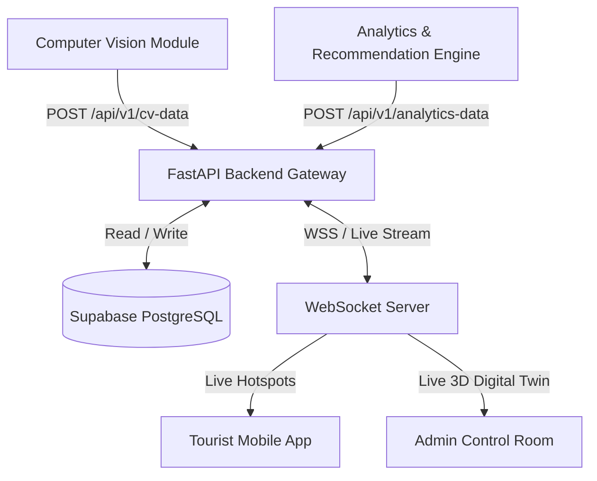

# System API Specification & Architecture Document
## Smart Tourism Flow Optimization Platform (SIH 2026)

**Project Focus Destination**: Shree Jagannath Temple, Puri, Odisha  
**Backend Framework**: FastAPI (Python 3.11+)  
**Database & Auth**: Supabase (PostgreSQL)  
**Real-Time Protocol**: WebSockets (WSS)  

---

## 1. System Architecture Overview



---

## 2. Ingestion APIs (Internal Worker Pipelines)

### 2.1 Computer Vision Ingestion
- **Endpoint**: `POST /api/v1/cv-data`
- **Source**: Computer Vision Pipeline (YOLOv8 + ByteTrack)
- **Frequency**: Every 3–5 seconds per camera stream
- **Description**: Receives real-time person counts, bounding box summaries, and density levels per gate.

#### Request Headers
```http
Content-Type: application/json
X-Service-Key: <CV_WORKER_SECRET_KEY>
```

#### Request Payload
```json
{
  "timestamp": "2026-08-27T19:30:00Z",
  "camera_id": "CAM_01_SINGHADWARA",
  "gate_no": "Gate_A",
  "crowd_number": 180,
  "density": "high",
  "confidence": 0.94
}
```

#### Response (201 Created)
```json
{
  "status": "success",
  "record_id": "cv_record_90123",
  "ingested_at": "2026-08-27T19:30:00.120Z"
}
```

---

### 2.2 Analytics & Recommendation Ingestion
- **Endpoint**: `POST /api/v1/analytics-data`
- **Source**: Analytics Engine (Prophet + Scikit-Learn Heuristics)
- **Frequency**: Every 1–5 minutes
- **Description**: Ingests risk models, 15-minute crowd surge predictions, and generated rerouting options.

#### Request Payload
```json
{
  "zone": "Gate_A",
  "capacity_utilization": 90,
  "risk": {
    "level": "high",
    "score": 82
  },
  "predicted_crowd": 230,
  "prediction_window": "15min",
  "congestion_probability": 85,
  "recommended_action": "Redirect visitors to Gate B",
  "recommended_visit_time": "5:00 PM",
  "alerts": [
    {
      "severity": "high",
      "zone": "Gate_A",
      "message": "Gate approaching 90% maximum capacity"
    }
  ]
}
```

---

## 3. Tourist Mobile App APIs (Flutter Client)

### 3.1 Live Crowd & Gate Status
- **Endpoint**: `GET /api/v1/crowd-status`
- **Description**: Returns live waiting times, crowd density, and recommended gate to enter.

#### Query Parameters
| Parameter | Type | Required | Description |
| :--- | :--- | :--- | :--- |
| `destination_id` | string | Optional | Default: `puri_shree_mandira` |

#### Response (200 OK)
```json
{
  "destination_id": "puri_shree_mandira",
  "overall_status": "HIGH_SURGE",
  "recommended_gate": "Gate_B",
  "last_updated": "2026-08-27T19:30:00Z",
  "gates": [
    {
      "gate_id": "Gate_A",
      "gate_name": "Singhadwara (Lion Gate)",
      "crowd_count": 340,
      "capacity_utilization_pct": 94,
      "wait_time_mins": 45,
      "status": "CRITICAL"
    },
    {
      "gate_id": "Gate_B",
      "gate_name": "Ashwadwara (Horse Gate)",
      "crowd_count": 65,
      "capacity_utilization_pct": 25,
      "wait_time_mins": 5,
      "status": "NORMAL"
    }
  ]
}
```

---

### 3.2 Book Fast-Track Return Slot
- **Endpoint**: `POST /api/v1/tourist/return-slot`
- **Description**: Books an optimal return-time window during predicted low-surge hours.

#### Request Payload
```json
{
  "user_id": "usr_9921",
  "preferred_hour": "17:00",
  "party_size": 2
}
```

#### Response (200 OK)
```json
{
  "slot_id": "SLOT_PURI_882",
  "valid_window": "5:00 PM - 5:30 PM",
  "gate_assigned": "Gate_B",
  "qr_pass_code": "YATRA_PASS_8829102",
  "status": "CONFIRMED"
}
```

---

### 3.3 Tourism Redistribution Circuits
- **Endpoint**: `GET /api/v1/recommendations/tourism-circuits`
- **Description**: Returns secondary heritage craft villages, water tanks, beaches, and local food spots to visit during long queue periods.

#### Response (200 OK)
```json
{
  "heritage_sites": [
    {
      "name": "Raghurajpur Heritage Craft Village",
      "distance": "12 km",
      "travel_time": "20 mins",
      "crowd_level": "low",
      "highlight": "Master Pattachitra artisans & Gotipua dance"
    }
  ],
  "food": [
    {
      "name": "Ananda Bazar Mahaprasad",
      "distance": "200 m",
      "wait_level": "moderate"
    }
  ],
  "culture": [
    {
      "name": "Narendra Pushkarini Tank",
      "distance": "1.5 km",
      "highlight": "Chandan Yatra boat festival pavilion"
    }
  ]
}
```

---

## 4. Admin Command Center APIs (React Dashboard)

### 4.1 Executive Analytics Overview
- **Endpoint**: `GET /api/v1/admin/analytics/overview`
- **Description**: Aggregates total present visitors, capacity gauges, 15-minute surge probabilities, and alert tallies.

### 4.2 Manual Gate Rerouting Override
- **Endpoint**: `POST /api/v1/admin/override-gate`
- **Description**: Allows control room operators to manually lock an entry gate or override automated rerouting rules.

#### Request Payload
```json
{
  "gate_id": "Gate_A",
  "action": "LOCK_ENTRY",
  "redirect_target": "Gate_B",
  "reason": "Emergency crowd dispersal"
}
```

---

## 5. Real-Time WebSocket Interface

- **URI**: `WS /ws/v1/live-feed`
- **Protocol**: JSON over WebSockets
- **Description**: Streams live crowd counts, particle hotspot telemetry, and alert notifications to web and mobile clients in under 150ms.

#### Sample Broadcast Frame
```json
{
  "event": "CROWD_UPDATE",
  "data": {
    "gate_id": "Gate_A",
    "count": 340,
    "capacity_pct": 94,
    "status": "CRITICAL",
    "timestamp": "2026-08-27T19:30:02Z"
  }
}
```

---

## 6. External Third-Party Integration Matrix

| Integration | Library / Provider | Purpose |
| :--- | :--- | :--- |
| **Geospatial Maps** | Leaflet / OpenStreetMap | Renders interactive maps & computes routing travel times to secondary sites. |
| **Database & Auth** | Supabase (PostgreSQL) | Manages tables (`Gates`, `Crowd`, `Analytics`, `Attractions`, `Alerts`, `Users`). |
| **Push Notifications** | Firebase Cloud Messaging (FCM) | Pushes instant gate redirect alerts and return-slot passes to tourist phones. |

---

## 7. Implementation Blueprint (FastAPI Starter)

Below is the Python code implementation for `main.py` using FastAPI and Pydantic v2:

```python
from fastapi import FastAPI, HTTPException, WebSocket, WebSocketDisconnect
from pydantic import BaseModel, Field
from typing import List, Optional
from datetime import datetime

app = FastAPI(
    title="YatraFlow Smart Tourism API",
    version="1.0.0",
    description="Adaptive Crowd Management & Visitor Flow Optimization Platform API (SIH 2026)"
)

# --- Pydantic Data Schemas ---
class CVDataInput(BaseModel):
    timestamp: datetime
    camera_id: str
    gate_no: str
    crowd_number: int = Field(ge=0, description="Total detected persons")
    density: str = Field(pattern="^(low|moderate|high|critical)$")
    confidence: float

class GateStatus(BaseModel):
    gate_id: str
    gate_name: str
    crowd_count: int
    capacity_utilization_pct: int
    wait_time_mins: int
    status: str

# --- API Routes ---
@app.post("/api/v1/cv-data", status_code=201)
async def ingest_cv_data(payload: CVDataInput):
    # Store in Supabase 'Crowd' table
    return {"status": "success", "gate": payload.gate_no, "count": payload.crowd_number}

@app.get("/api/v1/crowd-status")
async def get_crowd_status():
    return {
        "destination_id": "puri_shree_mandira",
        "recommended_gate": "Gate_B",
        "gates": [
            {"gate_id": "Gate_A", "gate_name": "Singhadwara (Lion Gate)", "crowd_count": 340, "capacity_utilization_pct": 94, "wait_time_mins": 45, "status": "CRITICAL"},
            {"gate_id": "Gate_B", "gate_name": "Ashwadwara (Horse Gate)", "crowd_count": 65, "capacity_utilization_pct": 25, "wait_time_mins": 5, "status": "NORMAL"}
        ]
    }
```
