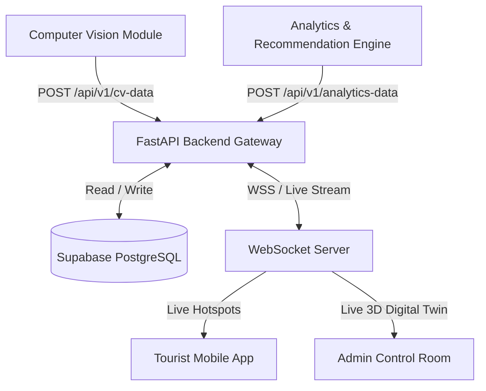

# System API Specification & Architecture Document
## Smart Tourism Flow Optimization Platform (SIH 2026)

**Project Focus Destination**: Shree Jagannath Temple, Puri, Odisha  
**Backend Framework**: FastAPI (Python 3.11+)  
**Database & Auth**: Supabase (PostgreSQL)  
**Real-Time Protocol**: WebSockets (WSS)  

---

## 1. System Architecture Overview



---

## 2. Ingestion APIs (Internal Worker Pipelines)

### 2.1 Computer Vision Ingestion
- **Endpoint**: `POST /api/v1/cv-data`
- **Source**: Computer Vision Pipeline (YOLOv8 + ByteTrack)
- **Frequency**: Every 3–5 seconds per camera stream
- **Description**: Receives real-time person counts, bounding box summaries, and density levels per gate.

#### Request Headers
```http
Content-Type: application/json
X-Service-Key: <CV_WORKER_SECRET_KEY>
```

#### Request Payload
```json
{
  "timestamp": "2026-08-28T20:00:00Z",
  "camera_id": "CAM_01_SINGHADWARA",
  "gate_no": "Gate_A",
  "crowd_number": 180,
  "density": "high",
  "confidence": 0.94
}
```

---

### 2.2 Analytics & Recommendation Ingestion
- **Endpoint**: `POST /api/v1/analytics-data`
- **Source**: Analytics Engine (Prophet + Scikit-Learn Heuristics)
- **Frequency**: Every 1–5 minutes
- **Description**: Ingests risk models, 15-minute crowd surge predictions, and generated rerouting options.

#### Exact Production Analytics Payload
```json
{
  "zone": "Gate_A",
  "capacity_utilization": 72.0,
  "risk": {
    "level": "moderate",
    "score": 72
  },
  "predicted_crowd": 211,
  "prediction_window": "15min",
  "congestion_probability": 84,
  "alerts": [
    {
      "severity": "medium",
      "zone": "Gate_A",
      "message": "Crowd levels increasing"
    },
    {
      "severity": "high",
      "zone": "Gate_A",
      "message": "High congestion expected in next 15 minutes"
    }
  ],
  "internal_rerouting": {
    "recommended_gate": "Gate_E",
    "crowd_count": 40,
    "occupancy": 27
  },
  "external_recommendations": {
    "heritage_sites": [
      {
        "name": "Konark Sun Temple",
        "distance": "35 km",
        "crowd_level": "low"
      },
      {
        "name": "Raghurajpur Heritage Village",
        "distance": "12 km",
        "crowd_level": "low"
      },
      {
        "name": "Narendra Tank",
        "distance": "2 km",
        "crowd_level": "low"
      },
      {
        "name": "Blue Flag Beach",
        "distance": "4 km",
        "crowd_level": "moderate"
      }
    ],
    "food": [
      {
        "name": "Mahaprasad",
        "distance": "500 m"
      },
      {
        "name": "Khaja Market",
        "distance": "700 m"
      },
      {
        "name": "Ananda Bazaar",
        "distance": "300 m"
      }
    ],
    "culture": [
      {
        "name": "Pattachitra Workshop",
        "distance": "10 km"
      },
      {
        "name": "Gotipua Dance Performance",
        "distance": "8 km"
      },
      {
        "name": "Local Handicraft Market",
        "distance": "2 km"
      }
    ]
  },
  "recommended_visit_time": "5:00 PM",
  "recommended_action": "Redirect visitors to Gate_E"
}
```

---

## 3. Recommended Extra Fields for Production Optimization

While the current output schema is **100% complete for core features**, adding these 3 optional fields improves frontend display UX:

1. **`timestamp`** (e.g. `"timestamp": "2026-08-28T20:04:00Z"`)
   * *Why*: Allows frontends to display "Updated 30s ago" and sync live WebSockets smoothly.

2. **`travel_time` in External Recommendations** (e.g. `"travel_time": "45 mins"` for Konark Sun Temple)
   * *Why*: Helps tourist mobile apps display "35 km (45 mins away)" without needing a client-side map lookup.

3. **`gate_name` Human-Readable Title** (e.g. `"recommended_gate_name": "Hastidwara (North Gate)"`)
   * *Why*: Makes frontend rendering clean without hardcoding gate lookup maps.
